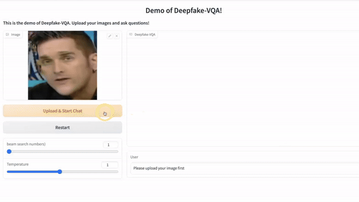

# Common Sense Reasoning for Deepfake Detection

> [**Common Sense Reasoning for Deep Fake Detection**](https://arxiv.org/abs/2402.00126),  
> Yue Zhang, Ben Colman, Xiao Guo, Ali Shahriyari, and Gaurav Bharaj  
> *ECCV 2024*

## DD-VQA Dataset
Please see our DD-VQA dataset in folder `DQ_FF++`. The images are cropped frames from the [FF++](https://github.com/ondyari/FaceForensics).

## Data Structure
1. The dataset is split based on  FF++.
2. For each type of manipulation, we provide the corresponding question-answer paris using a JSON file with the following format.
```json
 { "manitupateid_videoid" {
    "question_id":{
    "question": "Does the image/ the person's eyes/nose/mouth/eyebrows/ look fake?",
    "answer":["answer1", "answer2", "..."]
    }
    }
}
 "%The  manipulate_id is the manipulation types: 0: Deepfakes, 1:Face2face, 2: FaceShift, 3: FaceSwap,5: Original, 6: NeuralTexture."
```
